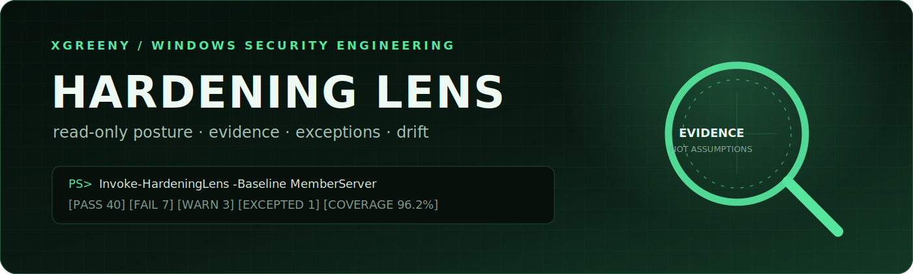
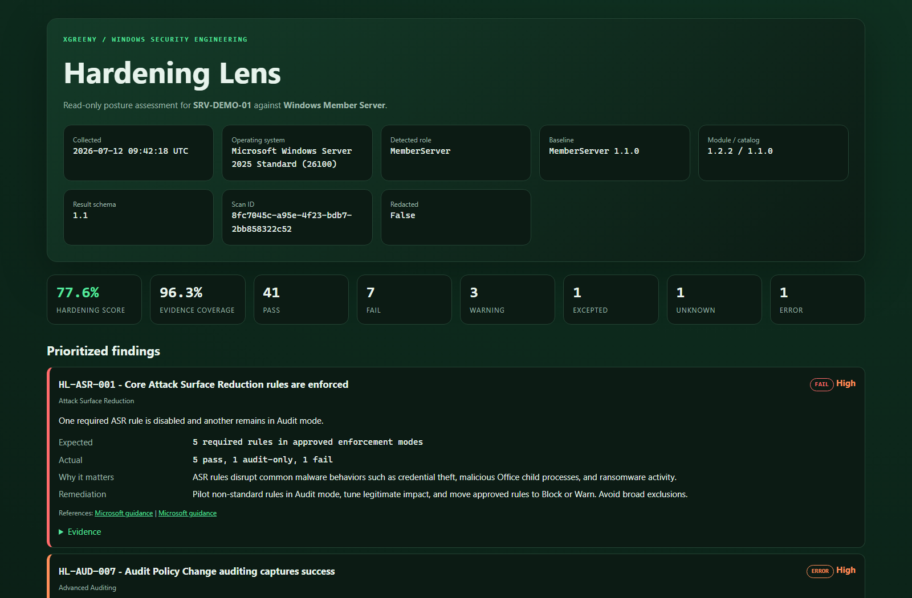
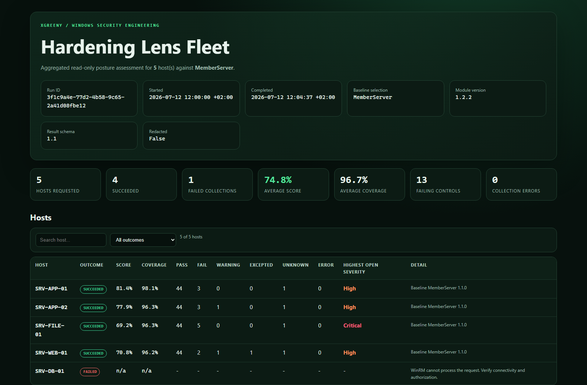

<p align="center">
  
</p>

<p align="center">
  <a href="https://github.com/xGreeny/hardening-lens/actions/workflows/quality.yml"></a>
  <a href="https://github.com/xGreeny/hardening-lens/actions/workflows/windows-live.yml"></a>
  
  
  <a href="LICENSE"></a>
  <a href="docs/CONTROL_REFERENCE.md"></a>
  <a href="https://www.powershellgallery.com/packages/HardeningLens"></a>
  <a href="https://www.powershellgallery.com/packages/HardeningLens"></a>
</p>

**Hardening Lens turns effective Windows security configuration into evidence you can review, diff, and govern.** It evaluates a local device against a role-aware baseline, explains every finding, applies only valid time-bounded exceptions, and exports a self-contained report without changing Windows configuration.

```text
observe → assess → explain → govern → diff
```

<p align="center">
  <a href="examples/sample-report.html"></a>
</p>

## Why this exists

Windows hardening is rarely a single policy import. Effective state is spread across registry policy, Windows security APIs, Defender configuration, optional features, local services, audit policy, event logs, and role-specific settings. A useful assessment must distinguish:

- a resolved misconfiguration from a collection failure;
- an audit-only rollout from enforced protection;
- an approved exception from a passing control;
- a secure default from a value that is merely absent;
- a posture regression from an intentional baseline change.

Hardening Lens makes those distinctions explicit in a stable result schema.

## Capabilities

| Capability | Implementation |
|---|---|
| **64 controls** | Curated checks for identity, credentials, network protection, remote administration, session security, Defender, ASR, VBS, audit policy, logging, BitLocker, Secure Boot, and PowerShell |
| **Four role baselines** | `Workstation`, `MemberServer`, `DomainController`, `AVDSessionHost` |
| **Read-only collection** | Registry, CIM, Windows APIs, and native Microsoft cmdlets; no remediation mode |
| **Locale-independent collection** | Failures classified through exception types and error codes rather than English message text; verified against localized Windows systems |
| **Evidence-first results** | Expected state, actual state, status, message, rationale, remediation, references, and raw evidence |
| **Governed exceptions** | Owner, rationale, ticket, target scope, baseline scope, approval, expiry, and compensating controls |
| **Configuration drift** | Field-level before/after state, baseline and catalog provenance, coverage delta, findings, and control-set changes |
| **Portable reports** | Self-contained HTML plus structured JSON and CSV |
| **Fleet support** | Pipeline-capable module command with complete per-host outcomes, run manifests, machine-readable failures, summary CSV, and one aggregated fleet HTML report |
| **Automation policy** | Deterministic gates for findings, score, evidence coverage, partial collection, and expired exceptions |
| **Reproducible provenance** | SHA-256 fingerprints for catalog, effective baseline, and exception register plus probe capabilities and timings |
| **Quality contract** | JSON Schemas, Pester, PSScriptAnalyzer, generated control documentation and demo assets, dual-edition CI, a scheduled full-baseline live smoke test on Windows, and PowerShell Gallery publishing |

## Quick start

Live collection requires Windows. Install from the [PowerShell Gallery](https://www.powershellgallery.com/packages/HardeningLens) and run from an elevated Windows PowerShell 5.1 or PowerShell 7 session:

```powershell
Install-PSResource HardeningLens    # PowerShellGet: Install-Module HardeningLens

Invoke-HardeningLens -Baseline Auto |
    Export-HardeningLensReport -OutputDirectory .\out
```

Alternatively, clone the repository and use the CLI wrapper, which runs the assessment, writes HTML/JSON/CSV, and returns an automation-friendly exit code:

```powershell
git clone https://github.com/xGreeny/hardening-lens.git
Set-Location .\hardening-lens

.\hardening-lens.ps1 `
    -Baseline Auto `
    -OutputDirectory .\out
```

```text
HARDENING LENS // SRV-DEMO-01
Baseline: Windows Member Server 1.1.0 | Score: 77.6% | Coverage: 96.3%
PASS 41  FAIL 7  WARN 3  EXCEPTED 1  UNKNOWN 1  ERROR 1  N/A 0

Top findings:
[HIGH    ] [FAIL    ] HL-ASR-001   Core Attack Surface Reduction rules are enforced
[HIGH    ] [FAIL    ] HL-BIT-001   Operating system volume is protected by BitLocker
[HIGH    ] [FAIL    ] HL-LAPS-003  Windows LAPS AD password encryption is enabled
[HIGH    ] [FAIL    ] HL-SMB-003   SMB server signing is required
```

The committed [sample result](examples/sample-result.json), [HTML report](examples/sample-report.html), [CSV](examples/sample-report.csv), and [drift report](examples/sample-drift.md) use synthetic data only.

## Module usage

```powershell
Import-Module HardeningLens
# from a clone: Import-Module .\src\HardeningLens\HardeningLens.psd1 -Force

$result = Invoke-HardeningLens `
    -Baseline MemberServer `
    -ExceptionsPath .\examples\exceptions.json `
    -NoConsole

$result | Export-HardeningLensReport `
    -Format Html, Json, Csv `
    -OutputDirectory .\out
```

### Exported commands

| Command | Purpose |
|---|---|
| `Invoke-HardeningLens` | Run a local read-only assessment |
| `Invoke-HardeningLensFleet` | Run complete, artifact-backed assessments across remote hosts |
| `Export-HardeningLensReport` | Export HTML, JSON, and CSV |
| `Export-HardeningLensFleetReport` | Export one aggregated HTML report for a fleet run |
| `Compare-HardeningLensResult` | Compare two scan results |
| `Get-HardeningLensBaseline` | Inspect or resolve baselines |
| `Get-HardeningLensControl` | Query the control catalog |
| `Test-HardeningLensBaseline` | Validate a custom baseline before deployment |
| `Test-HardeningLensPolicy` | Evaluate an assessment against automation thresholds |
| `Test-HardeningLensExceptionFile` | Validate exception governance and references |
| `New-HardeningLensExceptionFile` | Create a schema-compatible exception register |
| `Set-HardeningLensException` | Add, approve, update, or revoke an exception atomically |

## Baselines

| Baseline | Controls | Selection | Intended use |
|---|---:|---|---|
| `Workstation` | 56 | Automatic for Windows client role | Managed enterprise endpoints |
| `MemberServer` | 54 | Automatic for member-server role | Domain-joined or centrally managed servers |
| `DomainController` | 57 | Automatic for domain-controller role | AD DS with stricter identity, LDAP, LAPS, audit, and log checks |
| `AVDSessionHost` | 58 | Explicit | Pooled or personal Azure Virtual Desktop session hosts with session-security controls |

```powershell
Get-HardeningLensBaseline
Get-HardeningLensBaseline -Name DomainController -IncludeControls
```

`Auto` uses `Win32_OperatingSystem.ProductType`. AVD must be selected explicitly because the local Windows role does not reliably identify a session host. See [baseline design](docs/BASELINES.md) and the full [control matrix](docs/CONTROL_REFERENCE.md#baseline-matrix).

## What is assessed

The catalog covers:

- **Identity and privilege:** built-in accounts, anonymous access, UAC, LSA protection;
- **Credential protection:** WDigest, Credential Guard, Windows LAPS, NTLM policy;
- **Network protection:** Windows Firewall, SMBv1, SMB signing, insecure guest access, LLMNR;
- **Remote administration:** RDP NLA, WinRM encryption/authentication, Remote Registry, Remote Assistance;
- **Endpoint protection:** Defender real-time, cloud, behavior, IOAV, PUA, tamper protection, signatures, network protection, SmartScreen;
- **Attack surface:** curated ASR enforcement, AutoRun/AutoPlay, Windows PowerShell 2.0;
- **Security telemetry:** Script Block, Module, and process command-line logging; advanced audit subcategories; event-log capacity;
- **Platform and data:** Secure Boot, BitLocker, and memory integrity (HVCI);
- **Session security:** clipboard and drive redirection plus screen capture protection for session hosts, and Sudo for Windows;
- **Domain controllers:** LDAP signing, channel binding, LM hash storage, and DSRM password management.

Every catalog reference points to first-party Microsoft guidance. The catalog is Microsoft-aligned operational engineering, not a copied Microsoft Security Baseline or a compliance claim.

## Result model

Every control returns one of seven explicit states:

| Status | Interpretation |
|---|---|
| `Pass` | Effective state satisfies the selected baseline |
| `Fail` | Effective state is resolved and does not satisfy the baseline |
| `Warning` | State is transitional or audit-only, not fully enforced |
| `Excepted` | A `Fail` or `Warning` matches an Approved, unexpired exception |
| `Unknown` | The platform or provider cannot resolve the state |
| `Error` | Evidence collection failed operationally |
| `NotApplicable` | The control does not apply to the observed role or configuration |

The **hardening score** is severity-weighted and grants credit only to `Pass`. **Evidence coverage** independently measures how many applicable controls were resolved. See [scoring](docs/SCORING.md).

Result schema 1.1 records the module version independently from catalog and baseline content versions, hashes the exact assessment inputs, lists probe capabilities, and reports collection timing. This keeps results explainable when code and security content evolve on different release cadences.

## Exceptions that remain visible

An exception does not remove a finding. It changes the result to `Excepted`, preserves `originalStatus`, and attaches ownership, reason, ticket, expiry, approver, and compensating controls.

```powershell
New-HardeningLensExceptionFile `
    -Path .\exceptions.json `
    -ControlId HL-RA-001 `
    -Target 'AVD-PILOT-*' `
    -Baseline AVDSessionHost `
    -Status Approved `
    -Owner 'Workplace Engineering' `
    -Reason 'Approved support workflow requires solicited Remote Assistance.' `
    -Ticket 'SEC-1842' `
    -Expires (Get-Date '2027-06-30') `
    -ApprovedBy 'Security Engineering' `
    -CompensatingControl 'Access is restricted to the support group.', 'Session activity is logged.'

Test-HardeningLensExceptionFile -Path .\exceptions.json
```

Only Approved, unexpired entries matching control, host, and optional baseline scope are applied. See [exception governance](docs/EXCEPTIONS.md).

## Custom baselines without forking probes

```json
{
  "$schema": "../src/HardeningLens/Schema/baseline.schema.json",
  "schemaVersion": "1.0",
  "name": "NorthstarMemberServer",
  "displayName": "Northstar Member Server",
  "version": "1.0.0",
  "description": "Organization-specific member-server posture profile.",
  "extends": "MemberServer",
  "excludedControls": ["HL-BIT-001"],
  "controls": [
    {
      "id": "HL-LOG-001",
      "parameters": { "minimumSizeBytes": 2147483648 }
    },
    {
      "id": "HL-SVC-001",
      "severity": "Low"
    }
  ]
}
```

```powershell
Test-HardeningLensBaseline -Path .\examples\custom-baseline.json
Invoke-HardeningLens -BaselinePath .\examples\custom-baseline.json
```

Custom baselines can inherit, exclude, add, tune, and re-severity catalog controls. They cannot embed executable code or arbitrary probes. See [custom baseline rules](docs/CUSTOM_BASELINES.md).

## Detect posture drift

```powershell
Compare-HardeningLensResult `
    -Reference .\before.json `
    -Difference .\after.json `
    -Format Markdown `
    -OutputPath .\drift.md
```

```text
Score delta       -2.0 points
New findings       2
Resolved           1
Changed            1
Added controls     0
Removed controls   0
```

A drift finding records changes to status, severity, expected state, observed state, collected evidence, or exception governance. Collection timestamps and explanatory prose are intentionally ignored. Cross-target and cross-baseline comparisons are rejected unless explicitly enabled, reducing accidental comparisons of unrelated scans. A change does not imply that it was unauthorized, malicious, or operationally incorrect.

## Enforce an automation policy

```powershell
$policy = $result | Test-HardeningLensPolicy `
    -MaxFailed 0 `
    -MaxWarning 2 `
    -MinimumScore 85 `
    -MinimumCoverage 95 `
    -DisallowPartialCollection `
    -DisallowExpiredExceptions

if (-not $policy.Passed) { exit $policy.ExitCode }
```

Use `-FailOnViolation` when a terminating PowerShell error is the preferred CI contract. Policy evaluation validates the result first and returns every violation together rather than stopping at the first threshold.

## Assess a fleet

```powershell
Invoke-HardeningLensFleet `
    -ComputerName SRV-APP-01, SRV-FILE-01, SRV-WEB-01 `
    -Baseline MemberServer `
    -ExceptionPath .\exceptions.json `
    -OutputDirectory .\fleet-results `
    -ThrottleLimit 8
```

The command transfers the module to a temporary remote path, evaluates each host locally, and removes PowerShell remoting metadata. It writes exactly one success or failure outcome per requested host into a fully staged run directory containing host JSON, summary CSV, consolidated result, manifest, and a final commit marker. `-Force` swaps a complete committed run only after its replacement is ready, so a failed replacement leaves the prior run intact. The module is not installed remotely. The legacy script remains a compatibility wrapper.

Pipe the run into `Export-HardeningLensFleetReport` for one aggregated, self-contained HTML report with per-host scores, failed collections, and the controls affecting the most hosts:

```powershell
Invoke-HardeningLensFleet -ComputerName SRV-APP-01, SRV-FILE-01 -Baseline MemberServer -OutputDirectory .\fleet-results |
    Export-HardeningLensFleetReport -OutputDirectory .\fleet-results
```

<p align="center">
  
</p>

See the [operations guide](docs/OPERATIONS.md).

## Security properties

- Assessment probes do not modify Windows configuration.
- JSON inputs reference known catalog controls; they cannot inject PowerShell.
- Missing providers become `Unknown` or `Error`, not silent passes.
- HTML values are encoded and the report uses a restrictive Content Security Policy.
- Reports fetch no external scripts, styles, fonts, or images.
- Redaction replaces detected host, domain, and current-user identifiers.
- Approved exceptions require expiry and compensating controls.
- Releases are published to the PowerShell Gallery and as archives with SHA-256 checksums.

Hardening Lens output is security-sensitive. Redaction is targeted rather than universal; review reports before sharing. See the [security model](docs/SECURITY_MODEL.md) and [security policy](SECURITY.md).

## Requirements and compatibility

- Windows for live collection;
- Windows PowerShell 5.1 or PowerShell 7;
- elevation for complete evidence collection;
- local availability of the Windows feature or provider used by a control;
- PowerShell remoting only for the optional fleet helper.

Catalog, baseline, exception, report, and drift operations are cross-platform. Unsupported or non-authoritative providers produce explicit evidence gaps.

Install the module for the current user:

```powershell
Install-PSResource HardeningLens              # PSResourceGet
Install-Module HardeningLens -Scope CurrentUser   # PowerShellGet

# from a clone, without the PowerShell Gallery:
.\scripts\Install-HardeningLens.ps1 -Scope CurrentUser
```

## Quality gate

The repository contract is enforced through:

- Pester tests for catalog, baselines, scoring, value evaluation, exceptions, redaction, reports, and drift;
- PSScriptAnalyzer on module, scripts, CLI, build, and tests;
- JSON Schema validation and cross-file reference checks;
- deterministic generation of the control reference and demo assets;
- Windows PowerShell 5.1 and PowerShell 7 CI;
- a scheduled full-baseline live smoke test on a Windows runner that forbids collection errors in robust probe classes;
- tag-to-manifest version verification;
- versioned release archive and checksum generation;
- PowerShell Gallery publication for tagged releases.

```powershell
Install-Module Pester -MinimumVersion 5.6.1 -Scope CurrentUser
Install-Module PSScriptAnalyzer -Scope CurrentUser
python -m pip install -r requirements-dev.txt

.\build.ps1 -Task All
python .\tools\validate_repository.py
```

## Documentation

- [Control reference and baseline matrix](docs/CONTROL_REFERENCE.md)
- [Baseline design](docs/BASELINES.md)
- [Scoring and evidence coverage](docs/SCORING.md)
- [Exception governance](docs/EXCEPTIONS.md)
- [Custom baselines](docs/CUSTOM_BASELINES.md)
- [Operations guide](docs/OPERATIONS.md)
- [Architecture](docs/ARCHITECTURE.md)
- [Security model](docs/SECURITY_MODEL.md)
- [Troubleshooting](docs/TROUBLESHOOTING.md)

## Scope boundaries

Hardening Lens does **not** remediate settings, prove management-plane intent, continuously monitor a device, replace application compatibility testing, perform vulnerability scanning, or certify compliance with Microsoft, CIS, NIST, or another framework. It provides reproducible local evidence for engineering and security decisions.

## License

[MIT](LICENSE) © 2026 xGreeny
