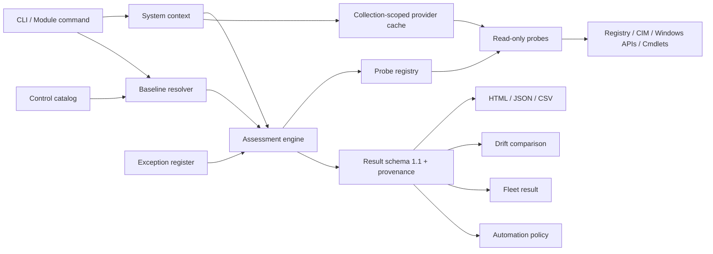

# Architecture

Hardening Lens separates **security intent**, **evidence collection**, **governance**, and **presentation**. This keeps probes reusable and allows the same result contract to support local operations, fleet collection, reports, and drift analysis.



## Module layout

```text
src/HardeningLens/
├── Data/
│   ├── Baselines/
│   └── control-catalog.json
├── Private/
│   ├── probe implementations
│   ├── baseline and scoring logic
│   ├── exception matching
│   ├── report rendering
│   └── drift comparison
├── Public/
│   └── exported commands
├── Schema/
│   └── JSON contracts
├── HardeningLens.psd1
└── HardeningLens.psm1
```

## Assessment flow

1. Confirm the platform is Windows and collect system context.
2. Enforce elevation unless partial collection is explicitly allowed.
3. Resolve a built-in or custom baseline against the catalog.
4. Validate the exception register before evaluating controls.
5. Resolve the named probe through an explicit parameter contract and capability registry.
6. Reuse collection-scoped provider snapshots where multiple controls query the same source.
7. Normalize the probe result to expected, actual, status, message, evidence, and duration.
8. Apply a matching Approved exception to `Fail` or `Warning` only.
9. Calculate score and evidence coverage.
10. Fingerprint the full catalog, effective baseline, and optional exception register with canonical SHA-256.
11. Optionally redact stable host identifiers.
12. Return one schema-versioned result object with a sorted capability snapshot.

## Control contract

A catalog control defines:

```text
identity          id, title, category, tags
risk context      severity, rationale
assessment        probe, parameters, expected state
operations        remediation
traceability      Microsoft references
```

A probe returns only:

```text
Status
Expected
Actual
Message
Evidence
```

The engine adds catalog metadata, collection time, probe duration, exception data, scan context, and provenance. This prevents probe implementations from inventing inconsistent result structures.

## Read-only boundary

No public or private assessment function contains a remediation path. State-changing operations are limited to:

- writing report and comparison files;
- creating or atomically updating an exception-register file;
- staging and atomically publishing complete fleet run directories;
- installing a copy of the module when the dedicated installer is invoked;
- creating temporary module files during fleet collection.

Windows security configuration itself is never modified.

## Cross-platform boundary

Live collection requires Windows. The following operations remain cross-platform:

- catalog and baseline inspection;
- custom baseline resolution;
- structured baseline validation;
- exception validation;
- policy evaluation;
- report generation from existing JSON;
- result comparison;
- repository tests that use synthetic fixtures.

This split allows CI on both Windows PowerShell 5.1 and current PowerShell without pretending Windows evidence APIs exist on Linux.

## Extension model

A new probe requires:

1. a private function returning `Get-HLProbeResult`;
2. a parameter and capability contract in the probe registry;
3. one or more catalog controls;
4. role placement in built-in baselines where appropriate;
5. Pester coverage and synthetic fixtures;
6. first-party documentation references;
7. regenerated control documentation.

Arbitrary probe code cannot be embedded in JSON baselines or exception files.
